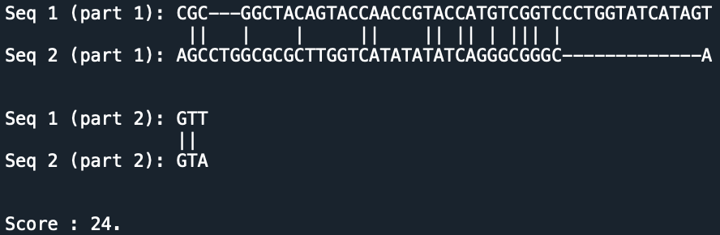

# Sequences Alignment

## Overview 

Adaptation of the Needleman-Wunsch algorithm (which computes a global alignment between sequences) with custom gaps length and associated costs. A description of the initial NW algorithm can be found here : [Needleman–Wunsch algorithm](https://en.wikipedia.org/wiki/Needleman–Wunsch_algorithm). 

However, in this implementation you can define the possible gaps length and their associated costs when opening or extending a gap by the length considered. You can also change the costs of matches and mismatches (they are set to -1 and 1 by default).

For instance, `{1  : (4,2), 3 : (5,3)}` means we can have gaps of length 1, for which the costs for opening and extending such a gap are 4 and 2 respectively. We can also have gaps of length 3, for which the costs for opening and extending are 5 and 3 respectively.

Then the algorithm prints the alignment in a way similar to [Blast](https://blast.ncbi.nlm.nih.gov/Blast.cgi?CMD=Web&PAGE_TYPE=BlastHome).

## Examples

We considered the gaps `{1  : (4,2), 3 : (5,3)}`.

### Example 1 : comparing a coding sequence of Covid-19 with a coding sequence of a previous Coronavirus

### Example 2 : comparing random sequences of size 50 and 40

