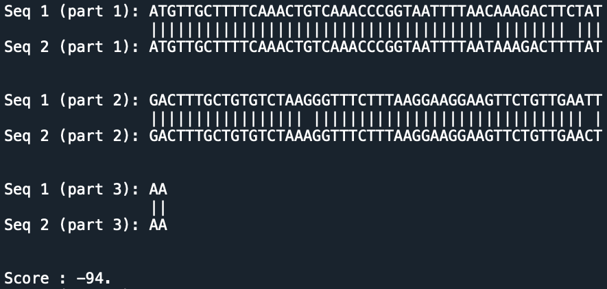

# Sequences Alignment

## Overview 

Adaptation of the Needleman-Wunsch algorithm (which computes a global alignment between sequences) with custom gaps length and associated costs. A description of the initial NW algorithm can be found here : [Needleman–Wunsch algorithm](https://en.wikipedia.org/wiki/Needleman–Wunsch_algorithm). 

Print the alignment in a way similar to [Blast](https://blast.ncbi.nlm.nih.gov/Blast.cgi?CMD=Web&PAGE_TYPE=BlastHome).

## Examples

The possible gaps considered were 1 and 3, with respective probabilities of opening/extending of (4,2) and (5,3) respectively. 

### Example 1 : comparing a coding sequence of Covid-19 with a coding sequence of a previous Coronavirus

### Example 2 : comparing random sequences of size 50 and 40
